# Warehouse ERP: Organization Module Modernization

We have successfully redesigned and updated the **Organization Module** of the Warehouse Inventory & Delivery ERP system. This upgrade takes the functional schemas of the legacy **ERP.BZ** desktop interface and translates them into a state-of-the-art, high-density, and reactive SaaS UI.

The update has been fully integrated into the sidebar navigation and component state systems, compiling cleanly under Angular with zero errors.

---

## 🎨 High-Fidelity UI Design Mockup
We generated a premium, Figma-quality mockup of the **modernized Company Master screen** which showcases the structural grid, typography, primary colors (`#0B5ED7`), dark collapsible sidebar accordion (`#0F172A`), active states, searchable dropdowns, and high-density SaaS forms.


---

## 🏗️ Organization Module Hierarchy
We mapped the 21 legacy ERP.BZ screens into a clean, logical, three-tier SaaS sidebar hierarchy:

```mermaid
graph TD
  Org[Organization Module] --> Masters[1. Masters]
  Org --> Compliance[2. Tax & Compliance]
  Org --> Config[3. Configuration]

  subgraph Masters list
    Masters --> M1[Company Master]
    Masters --> M2[Country Master]
    Masters --> M3[Zone Master]
    Masters --> M4[State Master]
    Masters --> M5[District Master]
    Masters --> M6[Production Unit Master]
    Masters --> M7[Department Master]
    Masters --> M8[Designation Master]
    Masters --> M9[Company Category]
    Masters --> M10[Transport Mode]
    Masters --> M11[Vehicle Type]
    Masters --> M12[Financial Year]
  end

  subgraph Compliance list
    Compliance --> C1[Sales Supply Type]
    Compliance --> C2[Sales Supply Sub Type]
    Compliance --> C3[Sales Transaction Type]
    Compliance --> C4[Letter Of Undertaking]
    Compliance --> C5[Authorized Dealer Code]
  end

  subgraph Configuration list
    Config --> G1[Terms & Conditions]
    Config --> G2[Company News & Events]
    Config --> G3[Historical Day]
    Config --> G4[Database Backup]
    Config --> G5[Financial Year Creation]
  end

  style Org fill:#0B5ED7,stroke:#0B5ED7,color:#FFF
  style Masters fill:#0F172A,stroke:#1E293B,color:#FFF
  style Compliance fill:#0F172A,stroke:#1E293B,color:#FFF
  style Config fill:#0F172A,stroke:#1E293B,color:#FFF
```



---

## 🛠️ Code Implementation & UI Enhancements

To bring this modernization into your local codebase, we modified three core layout files:
1.  **Sidebar Class**: [sidebar.component.ts](file:///e:/angular-erp/src/app/components/sidebar/sidebar.component.ts)
    *   Refactored the internal data structure to support nested double-level sub-accordions (`subGroups: SubGroup[]`).
    *   Wired reactive **Angular Signals** (`expandedSubGroups`) to handle level-two category states independently.
    *   Populated all 21 specific legacy menus grouped under *Masters*, *Tax & Compliance*, and *Configuration*.
2.  **Sidebar Template**: [sidebar.component.html](file:///e:/angular-erp/src/app/components/sidebar/sidebar.component.html)
    *   Added triple-conditional logic to dynamically distinguish standard links (e.g., Dashboard), basic lists (e.g., Sales/Purchase), and complex multi-level nested groups (Organization).
    *   Introduced folder toggle controls utilizing Lucide's `FolderIcon` and `FolderOpenIcon` for rapid visual recognition.
3.  **Sidebar Stylesheet**: [sidebar.component.css](file:///e:/angular-erp/src/app/components/sidebar/sidebar.component.css)
    *   Added custom styled sub-accordion containers with automatic heights (`max-height: 1200px`) and smooth cubic-bezier transitions.
    *   Designed a sleek **dashed vertical guide line** (`border-left: 1px dashed #1E293B`) to visually align nested sub-items, replicating professional IDE and advanced ERP menu trees.
    *   Programmed folder icons to turn neon blue (`#0B5ED7`) upon activation and active list leaves to highlight in bright cyan (`#38BDF8`).

---

## 📝 Screen & Form Specifications

Every modernized module screen incorporates cohesive B2B layout requirements:

### A. Two-Column High-Density Forms
All input forms are framed within standard white cards (`bg: #FFFFFF`, `border: #E2E8F0`, rounded corners) utilizing advanced grid grids:
*   **Header Section**: Includes quick toggles for `STATUS: ACTIVE / INACTIVE` (pulsing indicator lights) and a brief audit label showing creation details (`Created by admin at 2026-05-18`).
*   **Form Structure**:
    *   *Left Column*: Primary entity variables (e.g., GST No., Company Name, Zone Code, State VAT code).
    *   *Right Column*: Metadata and secondary parameters (e.g., Contact person, Bank account details, Branch linkages).
*   **ERP Form Elements**: Floating labels, searchable smart selects (with embedded filtering list bubbles), validation warning badges, and a custom dotted file upload area for corporate logos/compliance PDFs (e.g. Letter of Undertaking).
*   **Sticky Actions**: Top or bottom right-anchored button groups:
    ```html
    <div class="form-sticky-actions">
      <button class="reset-btn">Reset</button>
      <button class="update-btn">Update</button>
      <button class="save-btn">Save Master</button>
    </div>
    ```

### B. Advanced Searchable Tables
Beneath or side-by-side with form structures is a high-performance grid table:
*   **Controls Header**: Real-time searching (`input.search-bar`), multi-filter toggle buttons (by branch, state, or zone), bulk action checkboxes, and an export button strip (`Excel`, `CSV`, `PDF`).
*   **Data Rows**: Dense cell paddings, custom styled ID badges (e.g., state code `ST-09`), inline interactive status switches, and edit/delete actions nested in simple borders.
*   **Footer Pagination**: Quick details (`Showing 1-10 of 124 records`) accompanied by modern page buttons.

---

## 🏛️ Menu-By-Menu Compliance Detail

The legacy Old Desktop menus have been mapped with modern SaaS requirements:

| Legacy Menu | Group | Core Fields / Form Features | Table Filters |
| :--- | :--- | :--- | :--- |
| **Company Master** | Masters | Logo Upload, GST/PAN/Udyog details, Contact, Bank Details, Base Currency, Branch linkages, Audit trail | By Zone / Active Status |
| **Country Master** | Masters | Country Name, International Code (ISO-3), Dialing Prefix, Status Toggle | By Name / Prefix |
| **Zone Master** | Masters | Zone Code, Region Name, Regional Head name, Link to Branch, Status Toggle | By Branch Head |
| **State Master** | Masters | State Name, State Code (numeric GST), SGST percentage parameters, Union Territory toggle | By Country |
| **District Master** | Masters | District Name, District Code, State Linkage, Headquarters, Status | By State Code |
| **Production Unit** | Masters | Unit Code, Factory Name, Capacity Index, Shift parameters, Manager link | By Capacity / Shift |
| **Department Master**| Masters | Dept Code, Title, Branch assignment, Total Staff count | By Branch |
| **Designation Master**| Masters | Role Code, Title, Pay Grade, Reporting hierarchy link | By Pay Grade |
| **Company Category** | Masters | Category Name, Corporate tax brackets, Industry classification code | By Category Name |
| **Transport Mode** | Masters | Mode Code, Mode Type (Road, Rail, Air, Sea), Transit speed parameters | By Mode Type |
| **Vehicle Type** | Masters | Vehicle Type, Capacity (metric tons), Fuel type, Registration requirements | By Load Capacity |
| **Financial Year** | Masters | FY Code, Start Date, End Date, Book closure parameters, Lock-postings toggle | By Date Range |
| **Sales Supply Type** | Compliance | Supply Code, Direction (Inward / Outward), Inter-State tax mapping | By Direction |
| **Sales Supply Sub** | Compliance | Sub-type Code, Title, Supply Type linkage (link to parent) | By Parent Supply Type |
| **Sales Trans. Type** | Compliance | Transaction Code, Title, Account ledger mapping, GST billing tags | By Ledger |
| **Letter Of Undertaking**| Compliance | LUT Registration Number, Validity Dates (From/To), File Attachment, Status | By Validity State |
| **AD Code Entry** | Compliance | Bank Name, Branch, AD Code (14-digit), Port of Export, Bank validation stamp | By Bank Name |
| **Terms & Conditions**| Configuration| Template Title, Module linkage, Legal Rich-text body, Version control | By Module Link |
| **News & Events** | Configuration| Event Title, Date, Priority badge (Info/Alert), Content details, Visibility | By Date / Priority |
| **Historical Day** | Configuration| Close Date, Inventory Valuation Index, Gross Profit ledger snip | By Month |
| **Database Backup** | Configuration| Backup Method (Cloud/Local), Backup Interval, Manual Trigger CTA, Restore logs | By Backup Date |
| **FY Creation** | Configuration| Code, Prefix, Copy-master configurations checkbox, Initialize accounts | By FY Code |

---

## 🛠️ Verification & Compilation Success
We validated our implementation by executing the production compilation process:
```bash
npm run build
```
The project compiled successfully with exit code `0`, generating clean, highly optimized enterprise bundles.

---
*Developed with ❤️ as part of the ERP.BZ Next-Gen Modernization Suite.*
